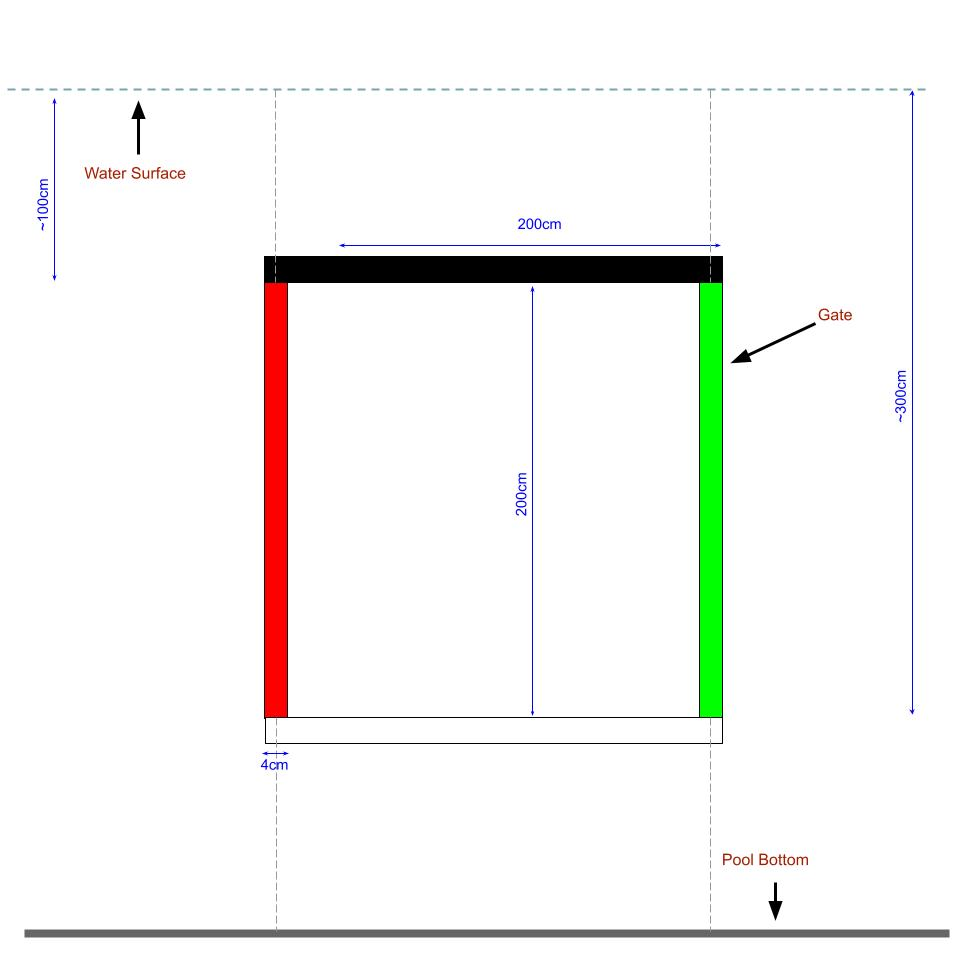
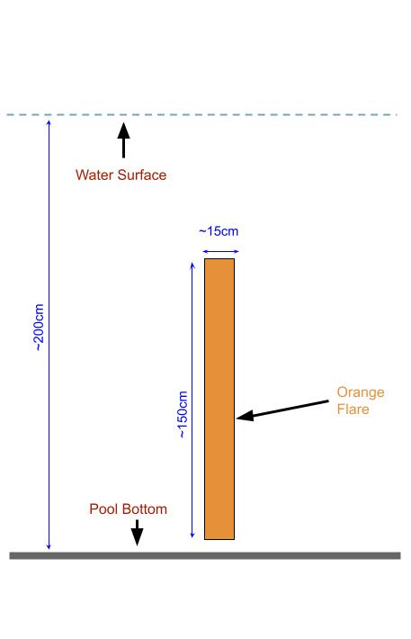

---

### Bonus Round : Oceanic Navigation

For SAUVC 2024, there is a bonus round with a single task called Oceanic Navigation. This was created to allow teams allow teams to experience the challenges of operating in an oceanic environment. The bonus round will be held in the [TCOMS Ocean Basin](https://www.tcoms.sg/), a cutting edge facility for testing and developing marine technology. The basin is located at the [National University of Singapore](https://www.nus.edu.sg/).

 TCOMS Ocean basin    Photo credit : <a href="https://www.facebook.com/191030801533400/photos/pb.100064187163543.-2207520000/1083302985639506">TCOMS</a>  

The aim of this task is for the AUV to swim through a gate in the middle of the pool. At the Ocean Basic, the AUVs will have to deal with waves and currents. Only the top teams from the final round will be invited to the bonus round.

**A orange flare** may be in located anywhere in the oceanic basin. The AUV **has to avoid** touching the orange flare. Any part of the AUV touching the orange flare causes an immediate abort of the attempt.

#### Arena (Ocean Basin)

The basin is equipped with a wave generator capable of generating waves up to 0.5m in height and a current generator capable of generating currents up to 1.5m/s. The wave and current generators may be activated during the bonus round.

 Top view of the ocean basin arena. 

Since the basin is a research facility, and the area is not open to the public, only a small number of the team members will be allowed to enter the basin. The rest of the SAUVC participants will have to watch the attempt from the viewing gallery. Details on the number of team members allowed to enter the basin will be released at a later date.

#### Starting Zone

The starting zone is a **140×140cm area** marked on the surface of water. The teams **must** start their AUVs from this area. The team may only place the AUV at the water surface, it must autonomously submerge **before** leaving the starting zone.

### Surfacing

Breaching the surface any point during the mission causes end of the current attempt. The team may wish to retry if they still have time left.

#### Points

There will be no points awarded for the bonus round. The teams will be ranked based on the time taken to the end of the attempt ONLY IF the team successfully managed to complete the task. The team with the fastest time will be ranked first for the bonus round.

#### Specification of props

The gate is located in the middle of the basin, ~25m from the starting zone. The gate is 200cm tall and 200cm wide. The gate is marked with red and green stripes on the port and starboard sides respectively.

|   |       Prop       |              Description                |
|---|:----------------:|:---------------------------------------:|
| 1 | Gate             | 200cm wide and 200cm tall gate with red and green markings on port and starboard sides respectively. |
| 2 | Orange Flare     | 150cm tall and ~15cm diameter flare, and orange in color. |

 Front-view of gate

 Front-view of the orange flare. 

#### Gameplay (Bonus round)

Only the top teams from the final round will be allowed to attempt the bonus round. Ranking for the bonus round will be tabulated separately from the main competition. The top teams in the bonus round will receive a special bonus prize regardless of their performance in the main competition.

There will be NO practice time for the bonus round. The teams will be given a time slot to attempt the bonus round. The teams will be given 15 minutes to attempt the bonus round. The teams may attempt the bonus round as many times as they wish within the 15 minutes time slot. The team may choose to abort the attempt at any time. However, the retreival of the AUV might take some time because of the logistics involved.

- All the [safety](#safety) conditions and [game procedures](#game-procedure) including [aborting](#aborting) still apply during the bonus round.
- **No communication** with the AUV is allowed during the bonus round.
- The teams are **not allowed deploy any other equipment** into the basin.
- Due to the sensitive nature of the equipment in the basin, the AUVs **must not touch the walls or the floor of the basin**. Any part of the AUV touching the walls of the basin causes an immediate abort of the attempt.