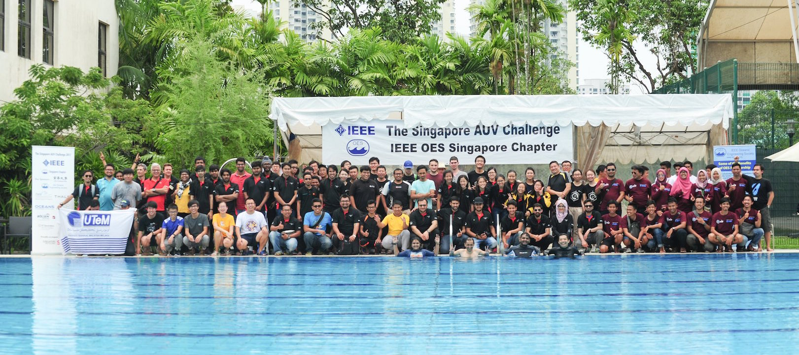

title: The Singapore AUV Challenge 2025 Rulebook
version: "6.0.1"
last_updated_date: 15 Oct 2025
year: 2026
---

Table of Contents
=================

- [Table of Contents](#table-of-contents)
  - [Objectives](#objectives)
  - [Structure of the Team](#structure-of-the-team)
  - [Video Submission](#video-submission)
  - [Updates to the Rulebook](#updates-to-the-rulebook)
  - [Safety](#safety)
  - [Others](#others)
  - [Feedback](#feedback)

## Objectives

The goal is for each team to develop an Autonomous Underwater Vehicle (AUV) which can negotiate the tasks put forth under a prescribed time and at the same time, to learn about underwater robotics and have fun in the process.

The SAUVC 2017 Participants.

## Structure of the Team

A team may consist of up to **11 participants**.

### Student Category

- Any **faculty advisors** count towards the maximum of 11 participants.
- At least half of the participants must be full-time students at the time of registration.

### Open Category

- If you don't meet the student category requirements, you can still participate in the open category.

One of the teams with faculty advisors from the 2017 Competition.

## Video Submission

All teams have to submit a video of their AUV prior to the competition. The video **HAS TO**

-  be **maximum 30 seconds** long,
-  be submitted before 23:59 4th January, 2026, [Anywhere On Earth](https://en.wikipedia.org/wiki/Anywhere_on_Earth),
-  showcase the tether-less operation of AUV swimming underwater for at least **10 seconds**.
-  show clearly that someone pressing the [Kill Switch](#safety) should stop all thrusters immediately.

**Note: The video will not be played beyond 30 seconds, so whatever you want to showcase, must be done strictly within the 30 seconds.**

Donts: For your video, DO NOT
- put the most important parts of the video after 30 seconds (safety, control etc.), as it will not be reviewed, without exception.
- you do not need to showcase an intro of team structure, university details etc - this will only take up valuable time in your video.

Videos will be reviewed by the organizing committee and **35 teams with the best vehicles will be short-listed to attend the competition. The above criteria are the basic necessary criteria, failing which the teams wont be short-listed.**

The organizers reserve the right to publish the video submissions after the competition.

## Updates to the Rulebook

The rulebook will be updated in from time to time. The latest version of the rulebook will be available on the [SAUVC website](https://sauvc.org). It is the responsibility of the teams to ensure that they are following the latest version of the rulebook.

**This is a preliminary version of the rulebook. The final version will be published in the next few months.**

## Safety

- AUVs must not leak and pollute the pool.
- AUVs must be designed and manufactured as to pose no danger of any kind to anyone or anything at the venue. This includes making sure that thrusters/propeller blades are shrouded.
- AUVs **must have a kill switch** that turns off the vehicle including thrusters, or any other population mechanism.
- The kill switch must be **easily accessible** to a diver. This must be marked in bright color.
- Pressure of any compressed gas used must not exceed **6 bars**.
- AUV must be completely autonomous.
- The use of explosives, fire or hazardous chemicals is prohibited. Certified lithium batteries are allowed.
- If lasers are used, they must be of class 2 or lower. Care must be taken to protect all persons at the venue from harm. Beams must be oriented in such a fashion that they cannot shine into the eyes of the spectators.

Example a kill switch on an AUV from 2015 Competition.

## Others

- The legitimacy of any actions not provided in this rulebook will be subject to discretion of the Judges.
- The dimensions, weights, etc. of the field, facilities and equipments stated in this rulebook have a margin of error of ±5% unless otherwise stated. However the dimensions and weights of the AUVs as stated in the rule book are the maximum and cannot be deviated.
- The Judges may demand additional explanations on safety issues when the safety of a vehicle is deemed to be in question.

## Feedback

If you spot any errors in the rulebook or have queries about the rules, please email rules@sauvc.org or contact us through [our website](https://sauvc.org/#contact).
