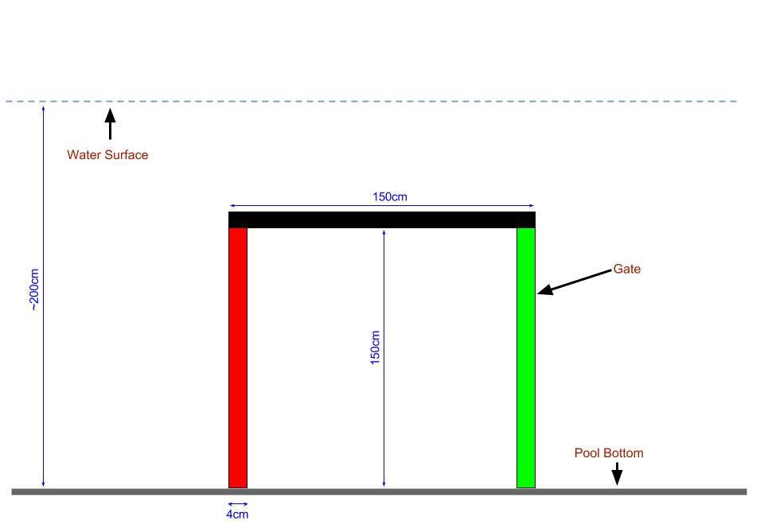
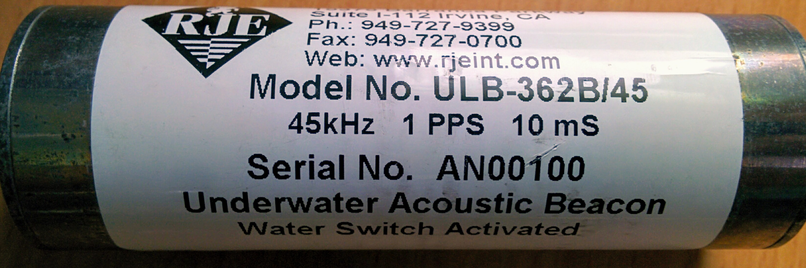

stitle: The Singapore AUV Challenge 2019 Rulebook
version: "3.0"
last_updated_date: 26 July 2018
year: 2019
---

<h1 class="print-only">The Singapore AUV Challenge 2019 Rulebook</h1>

## Table of Contents

* [Objectives](#objectives)
* [Structure of the Team](#structure-of-the-team)
* [Video Submission](#video-submission)
* [Qualification](#qualification)
* [The Arena](#the-arena)
  * [Starting Zone](#starting-zone)
* [Tasks](#tasks)
	* [1. Navigation](#1.-navigation)
	  * [Points](#points)
	  * [Specification of props](#specification-of-props)
	* [2. Target Acquisition](#2.-target-acquisition)
	  * [Points](#points-1)
	  * [Specification of props](#specification-of-props-1)
	* [3. Target Reacquisition](#3.-target-reacquisition)
	  * [Points](#points-2)
	  * [Specification of props](#specification-of-props-2)
	* [4. Localization](#4.-localization)
	  * [Points](#points-3)
	  * [Specification of props](#specification-of-props-3)
	* [Surfacing](#surfacing)
	* [Aborting](#aborting)
	* [Automatic Abort](#automatic-abort)
	* [Timing Bonus](#timing-bonus)
	* [Penalties](#penalties)
* [Specification of AUV](#specification-of-auv)
	* [Size](#size)
	* [Power](#power)
	* [Safety](#safety)
	* [Communications](#communications)
* [Game Procedure](#game-procedure)
	* [Sequence of events during the competition](#sequence-of-events-during-the-competition)
	* [Practice Rounds](#practice-rounds)
	* [Length of a game](#length-of-a-game)
	* [Retries](#retries)
* [Certificate of Participation](#certificate-of-participation)
* [General Restrictions](#general-restrictions)
* [Disqualification](#disqualification)
* [Others](#others)

## Objectives

The goal is for each team to develop an Autonomous Underwater Vehicle (AUV) which can negotiate the tasks put forth under a prescribed time. Also to learn and have fun in the process.

 The SAUVC 2017 Participants.

## Structure of the Team

A team may consist of up to **11 participants** including **faculty supervisors**. At least half of the participants must be non-professionals (students, hobbyists, hackerspace members, etc) at the time of registration.

 Figure 1. One of the teams with faculty co-supervisors from the 2017 Competition.

## Video Submission

All teams have to submit a video of their AUV prior to the competition. The video has to

-  be maximum **5 minutes** long,
-  be submitted before February 8, 2019,
-  showcase the AUV swimming underwater for at least **10 seconds**.
-  showcase the **operation and safety** of the [Kill Switch](#safety).

Videos will be reviewed by the organizing committee and **only teams with accepted videos be allowed to attend the competition**.

The organizers reserve the right to publish the video submissions after the competition.

## Qualification

- AUVs have to pass a qualifying round before they can participate in the main arena.
- To qualify, an AUV has to swim from **qualification starting line** and pass through the **qualification gate** without surfacing, touching the bottom/wall or the qualification gate.
- The time taken for the **last part** of the AUV to pass through the **qualification gate** will be counted towards the qualification time.
- Teams will be allocated a time slot for the qualification round. Teams may attempt multiple qualifying runs during the qualifying slot.
- If multiple qualifying runs are attempted during the qualifying slot, the fastest successful run will be considered for the final round.
- **Only the top 15** qualified teams, with the fastest time for the qualifying round, will advance to the final round.
- The time taken to pass the qualifier round decides the sequence in which the teams will participate in the final round of the competition. The team that finished the last in the qualifying round would participate first in the final round.

 Figure 2. A team attempting qualification in the 2017 Competition.

## The Arena

The challenge will be held in an olympic sized swimming pool (50m x 25m).

 Figure 3. Top-view of the Arena. 

 Figure 4. Picture of the Arena from 2017 Competition.

 Figure 5. Picture of the Arena from 2017 Competition.

### Qualification Arena(s)
The qualification rounds would be held on the side of the main arena.

The qualification starting line is a marked 1m wide section of the pool wall from where the AUV should be deployed from. The AUV **has to touch the wall** at the begining of the run.

At approximately 10m from the starting line the qualification gate is hanging from the surface of the water. The AUV has to go through the gate to qualify.

#### Specification of props

|   |       Prop           |              Description                |
|---|:--------------------:|:---------------------------------------:|
| 1 | Qualification Gate   | 150cm wide and ~100cm deep gate hanging from the water surface with orange markings on both port and starboard sides.

 Figure 6. Front-view of the qualification gate.

### Starting Zone
The starting zone is a **140×140cm area** marked on the surface of water. The teams  **must** start their AUVs from this area. The team may only place the AUV at the water surface, it must autonomously submerge **before** leaving the starting zone.

 Figure 7. Picture of the Starting Zone from 2017 Competition.

## Tasks
There are 4 tasks in the challenge:

1. [Navigation](#1.-navigation)
1. [Target Acquisition](#2.-target-acquisition)
1. [Target Reacquisition](#3.-target-reacquisition)
1. [Localization](#4.-localization)

The first task, Navigation, is mandatory and **must be completed** before attempting any other task. The other tasks can be attempted in any order. Surfacing at any point signifies end of attempt.

### 1. Navigation
The aim of the this task is to swim through a gate in water. The gate may be located anywhere on a horizontal line, parallel to the side of the swimming pool, approximately 8m away from the starting point. See Figure 4. The AUV has to swim through the 150 cm high gate without touching the gate.

 Figure 8. Picture of the gate from 2016 Competition.

#### Points

If the AUV successfully passes through the gate,10 Points will be awarded.

#### Specification of props

|   |       Prop       |              Description                |
|---|:----------------:|:---------------------------------------:|
| 1 | Gate             | 150cm wide and 150cm high gate with red and green markings on port and starboard sides respectively.

 Figure 9. Front-view of the gate.

### 2. Target Acquisition
The aim of the task is to detect and acquire a target among a series of drums at the bottom of the pool, in the target zone.

A target zone is defined by a green colored mat laid out on the floor of the pool. The mat is 8m x 2m in size. Figure 4. shows the location of the mat with respect to the arena.

There are 4 colored drums in the arena. All of them are on the mat. One of the drums, chosen at random, will be blue in color, while the rest are red in color. One of the red drums, chosen at random, will contain an acoustic pinger. The AUV needs to drop a ball in one of the drums to successfully complete this task. Points will be awarded based on which drum the ball is dropped into. In the event of multiple balls being dropped, only the **first ball** is taken to consideration.

The location of the red drum which contains the acoustic pinger may be randomized between attempts, as may be the order of the drums. The order of the drums and location of the pinger will be decided by the organizing committee.

#### Points

Points will be awarded as follows.

- Drop the ball in the blue drum: 30 Points
- Drop the ball in the red drum with the pinger: 50 Points
- Dropping the ball in any other red drum: 10 Points

#### Specification of props

|   |       Prop       |              Description                |
|---|:----------------:|:---------------------------------------:|
| 1 | Drum             | 60cm in diameter and 30cm in depth.     |
| 2 | Ball             | 3.5-4.5cm in diameter and weigh no more than 200g in air. Provided by teams. |
| 3 | Drum Pinger    | [RJE International Pinger Model No. ULB-362B/45 kHz](http://www.rjeint.com/wp-content/uploads/2017/01/ULB-362-ULB-362PL-Manual.pdf).|

 Figure 10. Picture target zone and drums from the 2017 Competition.

 Figure 11. Picture of a 45kHz pinger.

### 3. Target Reacquisition
The aim of this task is to reacquire a previously detected target.

This task is only attemptable if the [Target Acquisition](#2.-target-acquisition) has been successfully completed. Furthermore, the AUV has to leave the target zone, before it can attempt the Target Reacquisition task. Every part of the AUV needs to clear the target zone, before it can be considered outside the target zone.

After the AUV is outside the target zone, it needs to reacquire the target and pick up the ball that it dropped in the [Target Acquisition](#2.-target-acquisition) task. The AUV has to hold on to the ball till the end of attempt to successfully complete this task.

This task does not have to be attempted immediately after Target Acquisition task, other tasks may be attempted in between.

#### Points

If the AUV successfully picks up the ball and holds on to it till the end of the attempt, 60 Points will be awarded.

#### Specification of props

|   |       Prop       |              Description                |
|---|:----------------:|:---------------------------------------:|
| 1 | Target zone      | Green mat 8m x 2m in size.|
| 2 | Ball             | Same ball used in target acquisition task. Provided by the teams.|

### 4. Localization
The aim of this task is to localize on a flare. The flare is marked with an acoustic pinger. This flare could be located **anywhere** within the main arena. The AUV should locate and bump the flare causing the golf ball on the flare to drop out. The flare will be yellow in color.

#### Points

If the AUV successfully causes the ball to drop from the flare, 40 Points will be awarded.

#### Specification of props

|   |       Prop       |              Description                |
|---|:----------------:|:---------------------------------------:|
| 1 | Flare            | 80cm high and yellow in color.|
| 2 | Flare Pinger     | [RJE International Pinger Model No. ULB-362B/37.5 kHz](http://www.rjeint.com/wp-content/uploads/2017/01/ULB-362-ULB-362PL-Manual.pdf).|

 Figure 12. Side-view of the flare. 

 Figure 13. Picture of the flare from 2016 Competition.

 Figure 14. Picture of the flare from 2016 Competition.

### Surfacing

Breaching the surface any point during the mission causes end of the current attempt, the total points for that attempt will be computed based on the tasks accomplished in that attempt and the timing bonus (if applicable) and a 5 Points bonus for ending. The team may wish to retry if they still have time left.

### Aborting
At any time during the mission, current attempt can be aborted, by indicating to the Game Master. The divers would then retrieve the AUV back to the starting zone. The timing for the current attempt is stopped at the time of indication. The team may wish to retry if they still have time left.

In the case of an aborted attempt, the team would be awarded the points for all previously successfully completed tasks during the current attempt.

### Automatic Abort
If the AUV touches the bottom or the side walls of the pool for **a cumulative time of more than 10 seconds or 5 discrete touches**, the current attempt would be automatically aborted. The divers would then retrieve the AUV back to the starting zone. The team may wish to retry if they still have time left.

In the case of an automatic aborted attempt, the team would be awarded the points for all previously successfully completed tasks during the attempt.

### Timing Bonus

At the end of an attempt, as long as the AUV has successfully completed at least **2 tasks**, the Navigation task and any other task, bonus points proportional to the remaining time will be awarded in accordance with the following formula.

`Bonus points = (900 - RUN_TIME) • 0.03`

For eg. For a run time of 420s, Bonus = (900-420)•0.03 = 14.4 Points

### Penalties

There are penalty points for touching the floor or wall of the pool at any time, and also for touching the gate during a specific attempt. This penalty points are:

|   |               Description               | Penalty Points |
|---|:---------------------------------------:|:--------------:|
| 1 | Touching the gate                       |        2       |
| 2 | Touching the bottom of the pool or wall |        5       |

### Examples

Here are some examples scenarios and how they would be scored.

#### Example 1

- Team launches AUV from starting zone.
- AUV crosses the gate and completes the Navigation task, but touches the side of the gate while passing through.
- AUV can't find the location next task and ends the mission by rising to the surface.

|   |                 Task                    |     Points     |
|---|:---------------------------------------:|:--------------:|
| 1 | Navigation Task                         |        10      |
| 2 | Touching the gate                       |        -2      |
| 3 | Surfacing                               |        5       |
|   | **Attempt Total**                       |        13      |

#### Example 2

- Team launches AUV from starting zone.
- AUV crosses the gate and completes the Navigation task.
- AUV can't find the location of the next task and has to aborted and retrieved by divers.

|   |                 Task                    |     Points     |
|---|:---------------------------------------:|:--------------:|
| 1 | Navigation Task                         |        10      |
|   | **Attempt Total**                       |        10      |

#### Example 3

- Team launches AUV from starting zone.
- AUV crosses the gate and completes the Navigation task.
- AUV find the drums and successfully drops the ball in the blue drum, but touches the side of the wall momentarily while looking for the drum.
- AUV tries to find the flare, but can't find it and has to be aborted and retrieved by divers.

|   |                 Task                    |     Points     |
|---|:---------------------------------------:|:--------------:|
| 1 | Navigation Task                         |        10      |
| 2 | Target Acquisation Task (Visual)        |        30      |
| 3 | Touching the wall                       |        -5      |
|   | **Attempt Total**                       |        35      |

#### Example 3

- Team launches AUV from starting zone.
- AUV crosses the gate and completes the Navigation task.
- AUV find the drums and successfully drops the ball in the blue drum.
- AUV locates the flare and knocks off the golf ball.
- AUV surfaces with run time of 400 seconds.

|   |                 Task                    |     Points     |
|---|:---------------------------------------:|:--------------:|
| 1 | Navigation Task                         |        10      |
| 2 | Target Acquisition Task (Visual)        |        30      |
| 3 | Localization Task                       |        40      |
| 4 | Surface Bonus                           |         5      |
| 5 | Run time Bonus                          |        15      |
|   | **Attempt Total**                       |        100     |

#### Example 4

- Team launches AUV from starting zone.
- AUV crosses the gate and completes the Navigation task.
- AUV find the drums and successfully drops the ball in the blue drum.
- AUV locates the flare and knocks off the golf ball.
- AUV touches the bottom of the pool for more than 10 seconds while trying to find the target zone and gets automatically aborted by divers.

|   |                 Task                    |     Points     |
|---|:---------------------------------------:|:--------------:|
| 1 | Navigation Task                         |        10      |
| 2 | Target Acquisation Task (Visual)        |        30      |
| 3 | Localization Task                       |        40      |
|   | **Attempt Total**                       |        80      |

## Specification of AUV

### Size
- The AUV must fit within a 140 × 100 × 100 cm box.
- An AUV with dimension of less than 70 cm × 50 cm × 50 cm will be given bonus 10 points.
- The AUV must not weigh more than 50 kg in air.
- An AUV weighing less than 40 kg in air will be given bonus 10 points.

### Power
- Power must be self contained.
- **Tethers of any sort are not allowed**, except when [calibrating AUV sensors during practice rounds](#practice-rounds).
- The voltage of the power source used by each AUV must not exceed 24VDC.

### Safety
- AUVs must not leak and pollute the pool.
- AUVs must be designed and manufactured as to pose no danger of any kind to anyone or anything at the venue.
- AUVs **must have a kill switch** that turns off the vehicle, which is easily accessible to a diver. This must be marked in bright color.
- Pressure of any compressed gas used must not exceed **6 bars**.
- AUV must be completely autonomous.
- The use of explosives, fire or hazardous chemicals is prohibited. Certified lithium batteries are allowed.
- If lasers are used, they must be of class 2 or lower. Care must be taken to protect all persons at the venue from harm. Beams must be oriented in such a fashion that they cannot shine into the eyes of the spectators.

 Figure 15. Example a kill switch on an AUV from 2015 Competition.

### Communications
- No communication from/to the AUV of any sort is allowed during the game.

## Game Procedure

### Sequence of events during the competition

- AUVs will undergo weight and size check. Bonus points, if applicable, will be awarded.
- AUVs will be tested for battery, oil or lubricant leak check, and a waterproofness check. Failing either would bar the team from attempting to qualify until the AUV passes the checks.
- Team will proceed to qualifying round. The bonus points for size and weight is applicable only if the team passes the qualifying round.
- Top 15 qualified teams (according to fastest qualifying round times) will proceed to the final rounds of competition.

### Practice Rounds
- Teams will be allowed to practice in the main arena after they successfully complete the qualifying round, subject to availability of time slots and the schedule during the competition.
- No tethers are allowed at ANY time inside the main arena.
- Teams will be allowed calibrate their AUV sensors with tethers, at the edge of the pool, with the vehicle held **stationary**.

### Length of a game
- Each team is given **15 minutes** to complete the tasks.
- In any of the following cases, the game ends immediately.
  - Disqualification is announced in the game.
  - When the Judges determine that the game cannot continue.
- Setting up of AUV
  - Five minutes is given for setting up the AUV before the game starts.
  - No more than two members of respective teams can engage in setting up of their AUV at the poolside.
  - The two designated members setting up must wear life jackets. Failure to do so may result in disqualification.
  - Any team that fails to complete setting their AUV within five minutes can resume the setting up again once the game starts.
  - Setting up during the game uses the allocated time for the tasks and game.
  - The AUV can only start from the start zone. This is the only place where the AUV is allowed to be on the water surface.
  - The AUV must start its maneuver only after it has **completely submerged** in the water.

### Retries
- A retry attempt can be made only after the Judges' permission.
- The AUV will be passed to the two designated team members standing beside the pool by the divers.
- A retry would mean that the AUV starts from the start zone with 0 points
- A maximum of 15 minutes is allowed including all the retries.
- The attempt with the highest score (including retries) will be considered for final scoring.

## Certificate of Participation

- Teams whose AUVs successfully complete the qualifier round will receive Certificate of Participation.
- Teams whose video submissions have been accepted & attend the competition will receive a Certificate of Participation.
- Failing the above two criteria, no Certificate of Participation will be awarded.

## General Restrictions

- Team members are not allowed inside the swimming pool at any point during the game.
- Team members may not disturb the water surface once the game starts.
- Members of other teams are not allowed in the game area.
- Nobody is allowed to wear any footwear near the pool area.
- The Judges may suspend the challenge if weather turns unfavorable.
- The pool area must be evacuated in case of lightning.

## Disqualification

- Oil or lubrication leak causing the pollution of pool.
- Battery leak causing the pollution of pool.
- The AUV damages or tries to damage the field, facilities or equipments.
- The team performs any acts that are not in the spirit of fair play.
- The team fails to obey instructions or warnings issued by the Judges or Game Master.
- If the team does not abide by the the general restrictions.

## Others

- The legitimacy of any actions not provided in this rulebook will be subject to discretion of the Judges.
- The dimensions, weights, etc. of the field, facilities and equipments stated in this rulebook have a margin of error of ±5% unless otherwise stated. However the dimensions and weights of the AUVs as stated in the rule book are the maximum and cannot be deviated.
- The Judges may demand additional explanations on safety issues when the safety of a vehicle is deemed to be in question.

## Feedback

If you spot any errors in the rulebook or have queries about the rules, please email auvc.singapore@gmail.com or contact us through [our website](https://sauvc.org/#contact).
